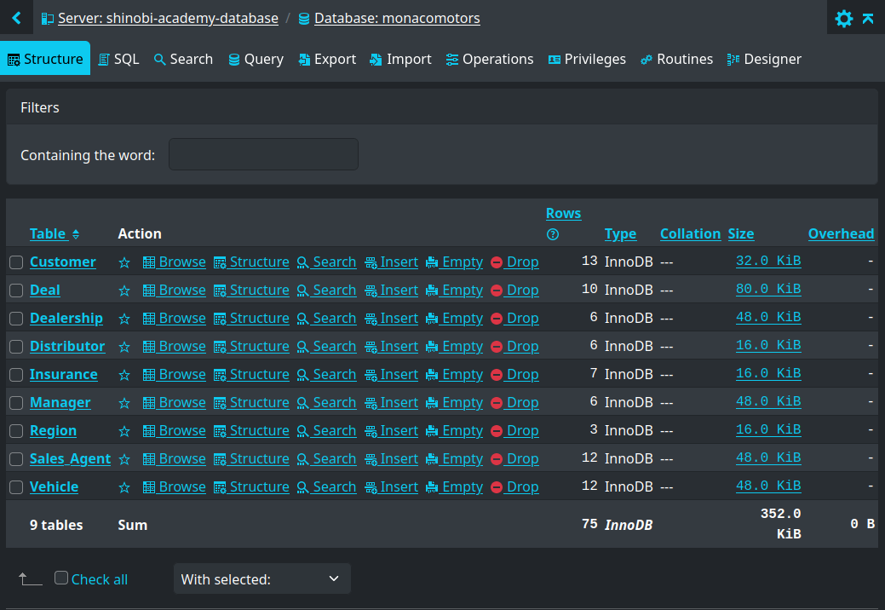

# Monaco Motors Schema

This document describes the schema of the MONACO_MOTORS database, which appears to be a system for managing a high-end car dealership.

The data includes information about customers, sales agents, managers, distributors, vehicles, deals, insurances, and regions.

### Overview

The Monaco Motors schema consists of the following tables:

1. **Customer:** Stores customer information, including their ID, agent ID, first name, last name, phone number, and email.

2. **Deal:** Stores information about deals made, including the deal ID, vehicle ID, agent ID, customer ID, insurance ID (optional), and deal date.

3. **Dealership:** Stores information about dealerships, including their ID, distributor ID, region ID, region zip code, and dealership name.

4. **Distributor:** Stores information about distributors, including their ID and name.

5. **Insurance:** Stores information about insurance policies, including the ID, policy type, and renewal date.

6. **Manager:** Stores information about managers, including their ID, dealership ID, distributor ID, first name, last name, salary, and bonus (optional).

7. **Region:** Stores information about regions, including the ID, zip code, and name.

8. **Sales_Agent:** Stores information about sales agents, including their ID, manager ID, dealership ID, first name, last name, and salary.

9. **Vehicle:** Stores information about vehicles, including the ID, dealership ID, distributor ID, make, model, body type, model year, and price.

## Customer Table

Stores customer information, including their ID, agent ID, first name, last name, phone number, and email.

| Column Name       | Data Type | Description                                 |
|-------------------|-----------|----------------------------------------------|
| CustomerID       | char(8)    | Unique identifier for the customer          |
| AgentID           | char(8)    | Foreign key referencing Sales_Agent.AgentID |
| CustFirstName     | varchar(15)| Customer's first name                      |
| CustLastName      | varchar(15)| Customer's last name                       |
| PhoneNumber       | varchar(12)| Customer's phone number                    |
| Email             | varchar(40)| Customer's email address                   |

## Deal Table

Stores information about deals made, including the deal ID, vehicle ID, agent ID, customer ID, insurance ID (optional), and deal date.

| Column Name  | Data Type         | Description                                           |
|--------------|--------------------|---------------------------------------------------------|
| DealID        | char(5)            | Unique identifier for the deal                         |
| VehicleID     | char(3)            | Foreign key referencing Vehicle.VehicleID              |
| AgentID       | char(8)            | Foreign key referencing Sales_Agent.AgentID            |
| CustomerID    | char(8)            | Foreign key referencing Customer.CustomerID           |
| InsuranceID   | char(5) (optional) | Foreign key referencing Insurance.InsuranceID (optional) |
| DealDate       | date               | Date the deal was made                                 |

## Dealership Table

Stores information about dealerships, including their ID, distributor ID, region ID, region zip code, and dealership name.

| Column Name    | Data Type         | Description                                             |
|----------------|--------------------|-----------------------------------------------------------|
| DealershipID   | char(5)            | Unique identifier for the dealership                   |
| DistributorID  | char(8)            | Foreign key referencing Distributor.DistributorID       |
| RegionID       | char(3)            | Foreign key referencing Region.RegionID                |
| RegionZIP      | char(5)            | Zip code of the region                                 |
| DealershipName | varchar(40)        | Name of the dealership                                 |

## Distributor Table

Stores information about distributors, including their ID and name.

| Column Name    | Data Type         | Description                                     |
|----------------|--------------------|-------------------------------------------------|
| DistributorID  | char(8)            | Unique identifier for the distributor         |
| DistributorName | varchar(40)        | Name of the distributor                         |

## Insurance Table

Stores information about insurance policies, including the ID, policy type, and renewal date.

| Column Name    | Data Type         | Description                                           |
|----------------|--------------------|---------------------------------------------------------|
| InsuranceID   | char(5)            | Unique identifier for the insurance policy           |
| PolicyType     | varchar(15)        | Type of insurance policy (e.g., Full Coverage, Liability) |
| RenewalDate    | date               | Date the insurance policy needs to be renewed        |

## Manager Table

Stores information about managers, including their ID, dealership ID, distributor ID, first name, last name, salary, and bonus (optional).

| Column Name    | Data Type         | Description                                               |
|----------------|--------------------|-------------------------------------------------------------|
| ManagerID      | char(8)            | Unique identifier for the manager                          |
| DealershipID   | char(5)            | Foreign key referencing Dealership.DealershipID           |
| DistributorID  | char(8)            | Foreign key referencing Distributor.DistributorID       |
| MngrFirstName  | varchar(15)        | Manager's first name                                       |
| MngrLastName   | varchar(15)        | Manager's last name                                        |
| MngrSalary     | decimal(8,2)        | Manager's annual salary                                    |
| MngrBonus      | decimal(8,2) (optional) | Manager's annual bonus (optional)                    |

## Region Table

Stores information about regions, including the ID, zip code, and name.

| Column Name    | Data Type         | Description                                     |
|----------------|--------------------|-------------------------------------------------|
| RegionID       | char(3)            | Unique identifier for the region            |
| RegionZIP      | char(5)            | Zip code of the region                    |
| RegionName     | varchar(15)        | Name of the region                        |

## Sales_Agent Table

Stores information about sales agents, including their ID, manager ID, dealership ID, first name, last name, and salary.

| Column Name    | Data Type         | Description                                               |
|----------------|--------------------|-------------------------------------------------------------|
| AgentID        | char(8)            | Unique identifier for the sales agent                      |
| ManagerID      | char(8)            | Foreign key referencing Manager.ManagerID                |
| DealershipID   | char(5)            | Foreign key referencing Dealership.DealershipID           |
| AgentFirstName | varchar(15)        | Sales agent's first name                                   |
| AgentLastName  | varchar(15)        | Sales agent's last name                                    |
| AgentSalary    | decimal(9,2)        | Sales agent's annual salary                                |

## Vehicle Table

Stores information about vehicles, including the ID, dealership ID, distributor ID, make, model, body type, model year, and price.

| Column Name    | Data Type         | Description                                             |
|----------------|--------------------|-----------------------------------------------------------|
| VehicleID      | char(3)            | Unique identifier for the vehicle                     |
| DealershipID   | char(5)            | Foreign key referencing Dealership.DealershipID       |
| DistributorID  | char(8)            | Foreign key referencing Distributor.DistributorID       |
| Make           | varchar(40)        | Make of the vehicle                                   |
| Model          | varchar(40)        | Model of the vehicle                                   |
| BodyType       | varchar(40)        | Body type of the vehicle                               |
| ModelYear      | int(11)            | Model year of the vehicle                              |
| Price          | decimal(9,2)        | Price of the vehicle                                   |
